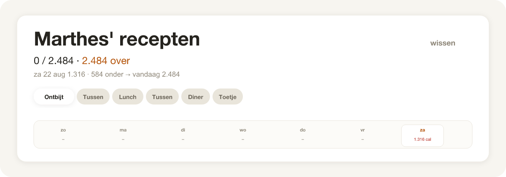
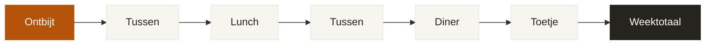
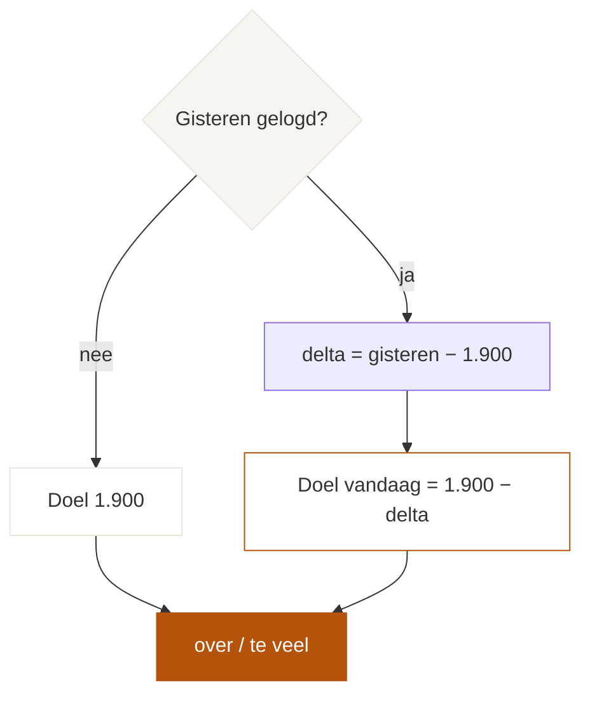

<p align="center">
  
</p>

<p align="center">
  
  
  
</p>

Mobiele recepten-app: vink wat je eet, zie wat er overblijft, en compenseer gisteren automatisch. Geen account, geen server — alles in één `index.html`.

---

## Dagindeling

```
  Ontbijt → Tussen → Lunch → Tussen → Diner → Toetje
     ①           ⑤          ②          ⑤         ③        ④
```

Drie schema’s per maaltijd. De twee tussendoortjes delen dezelfde recepten, maar tellen los.



## Wat het doet

| | |
| --- | --- |
| **Aanvinken** | Alleen wat je écht at telt. Mozzarella laten staan? Die kcal blijven over. |
| **Maaltijd** | `232 / 442` + hoeveel die maaltijd nog over heeft. |
| **Dag** | Gegeten vs doel. Standaard **1.900**. |
| **Week** | 7 dagen in localStorage, lokale datum (geen UTC-shift ’s avonds). |
| **Compensatie** | Gisteren 2.100 → vandaag 1.700. Geen vinkjes gisteren = geen straf, gewoon 1.900. |
| **Zoeken** | ~1.000 producten uit de calorietabel. |



## Schema’s

| | kcal | ontbijt | lunch | diner | toetje | tussendoor |
| ---: | ---: | --- | --- | --- | --- | --- |
| **1** | 1.904 | omelet | cracker caprese | kipkerrie + bonen | kwark | cashew + banaan |
| **2** | 1.902 | brood + pindakaas | crackers zalm/pesto | pita kip | protein pudding | dadel + appel |
| **3** | 1.902 | kwark + haver | shakshuka | wraps | kwark | framboos + cashew |
| **4** | — | | tonijnsalade (513) | | | |
| **5** | — | | | pasta zalm/spinazie (732) | | |

```
koolhydraten ████████████████████░░░░░░░░░░  50%
eiwitten     ██████████░░░░░░░░░░░░░░░░░░░░  25%
vetten       ██████████░░░░░░░░░░░░░░░░░░░░  25%
```

## Stack

Eén static file. Geen build, geen npm, geen backend.

```
index.html     app + recepten + calorietabel
build.py       optioneel: recepten opnieuw uit een .ods halen
vercel.json    Framework Other, skip install/build
```

Data zit in `<script id="fitdata">`. Weeklog in `localStorage` onder `fit42-week`. Ander domein = lege week — dat is normaal.

## Lokaal

```bash
python3 -m http.server 8642
```

Open `http://localhost:8642/` op je telefoon in hetzelfde netwerk, of via Safari-responsive in desktop.

## Deploy

GitHub → Vercel. Framework **Other**, root `.`, geen build. `vercel.json` forceert dat al.

---

<p align="center">
  <sub>Geen namen, geen gewicht, geen doelen — alleen het dieet.</sub>
</p>
